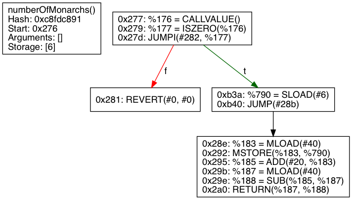

# rattle


Rattle is an EVM binary static analysis framework designed to work on deployed smart contracts. Rattle takes EVM byte strings, uses a flow-sensitive analysis to recover the original control flow graph, lifts the control flow graph into an SSA/infinite register form, and optimizes the SSA – removing DUPs, SWAPs, PUSHs, and POPs. The conversion from a stack machine to SSA form removes 60%+ of all EVM instructions and presents a much friendlier interface to those who wish to read the smart contracts they’re interacting with.

## Example

```bash
python3 rattle-cli.py --input inputs/kingofether/KingOfTheEtherThrone.bin -O
```

Would produce a register machine output like this:



Functions are recovered and split off. Additionally function arguments, memory locations, and storage locations are recovered.

## Usage
Rattle runs on the runtime contract hex string.

If you're running rattle on a contract you can compile with solidity, use the `--bin-runtime` option and strip off the header:
```console
$ solc --bin-runtime KingOfTheEtherThrone.sol 2>/dev/null | tail -n1 > contract.bin
```

## Dependencies

* python3
* graphviz
* cbor2
* pyevmasm

To install the python dependencies, run these commands:

```bash
python3 -m venv venv
source venv/bin/activate
pip install -r requirements.txt
```

To install graphviz, run the following command:

Linux:

```bash
sudo apt-get graphvis
```

macOS:

```bash
brew install graphviz
```

## Troubleshooting

If you get a syntax error like this:

```python
  File "rattle-cli.py", line 16
    def main() -> None:
               ^
SyntaxError: invalid syntax
```

You likely ran rattle with python2 instead of python3.

# Presentation

For more details on the Rattle design and features, see my reCON Montreal presentation, which is annotated [here](https://www.trailofbits.com/presentations/rattle/).

# License

Rattle is licensed and distributed under the AGPLv3 license. [Contact us](mailto:opensource@trailofbits.com) if you're looking for an exception to the terms.
